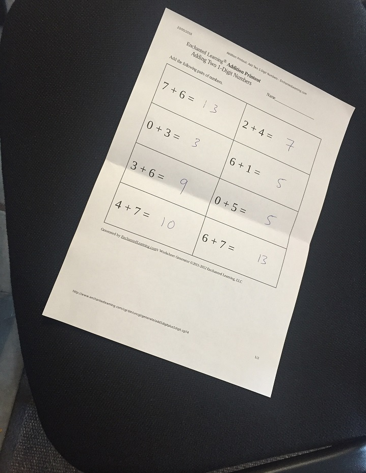
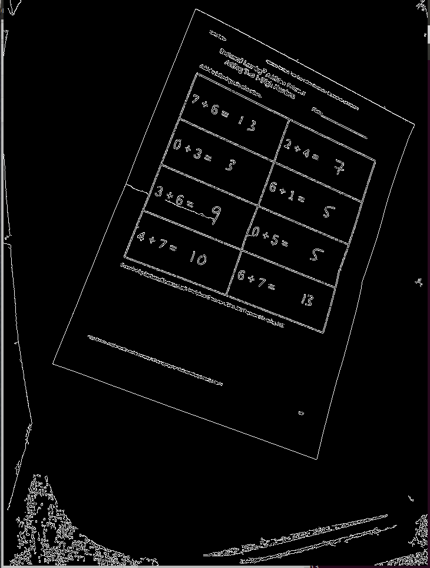
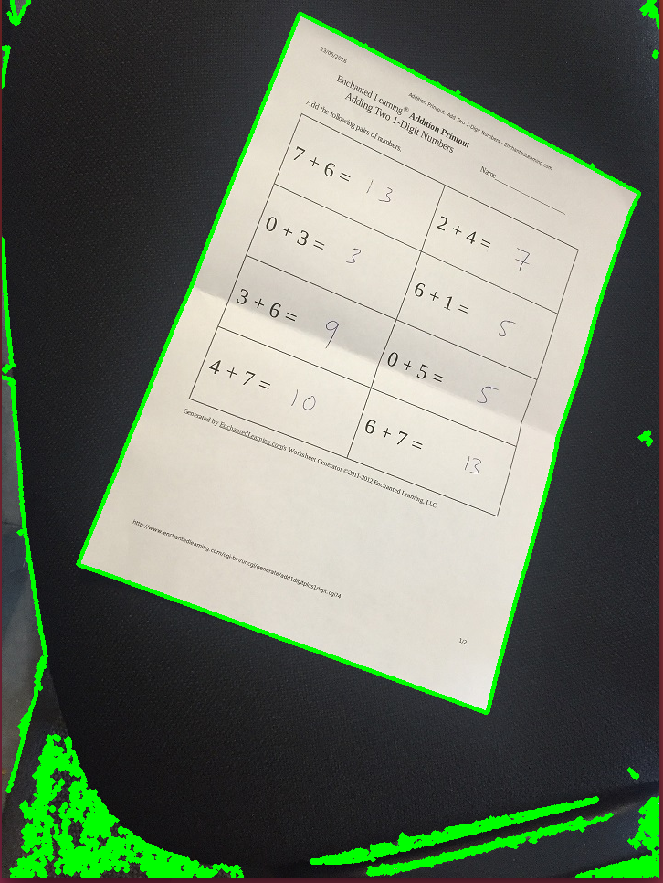

# Doc-Scanner
I am early on in my computer vision journey, but this is the first project I attempted to demonstrate the knowledge I have learned from online courses. I decided, what better way to learn OpenCV than to build something that already exists? Hence, I decided to rebuild a barebones version of the popular document scanning feature that Apple developed.

### How it works

The script utilizes OpenCV, a popular library used in robotics for image processing. First the script reads in an image from a local directory and converts the image to grayscale to reduce the size and detail of the image. 

Next, I used canny edge detection to find important images that define the features of the image and display them against a black background.

     
Using the canny edges and thresholding, I am able to use them to find and draw contours around the image. I decided to only take external contours as I only wanted the outline of the paper and used a simple chain approximation as I only needed endpoints for the line segments to find the corners. This did not work as expected for me because the image was not perfectly rectangular and required me to do some extra work for corner detection. This is what all of the contours of the image looked like.

