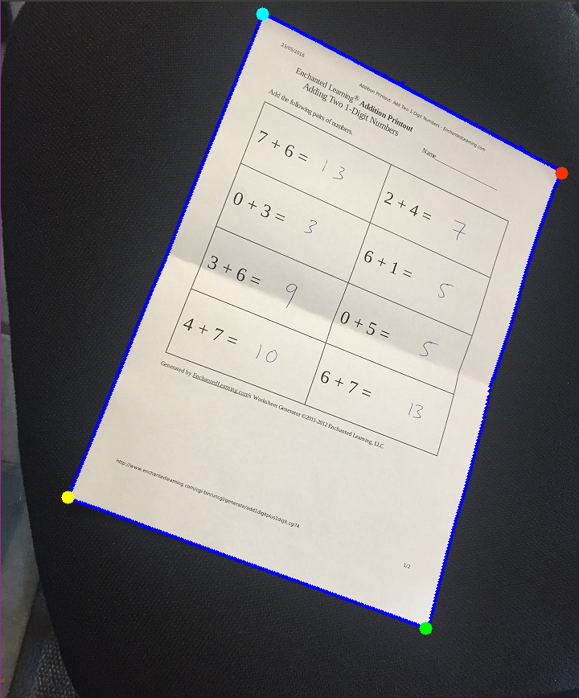
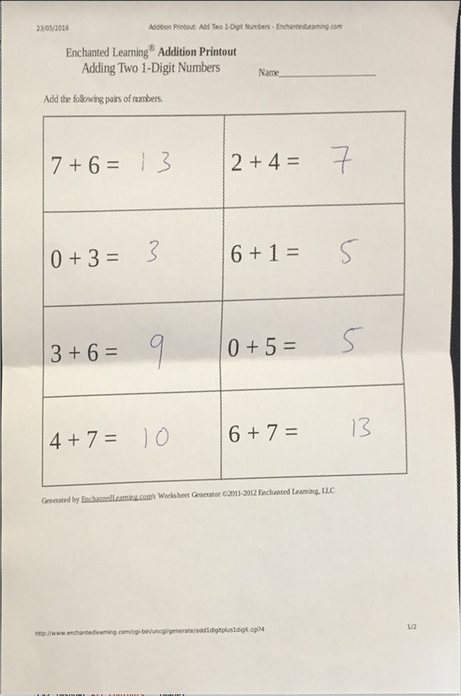

# Doc-Scanner
I am early on in my computer vision journey, but this is the first project I attempted to demonstrate the knowledge I have learned from online courses. I decided, what better way to learn OpenCV than to build something that already exists? Hence, I decided to rebuild a barebones version of the popular document scanning feature that Apple developed.

### How it works

The script utilizes ```OpenCV```, a popular library used in robotics for image processing. First the script reads in an image from a local directory and converts the image to grayscale to reduce the size and detail of the image. 


Next, I used ```canny edge detection``` to find important images that define the features of the image and display them against a black background.


     
Using the canny edges and thresholding, I am able to use them to find and ```draw contours``` around the image. I decided to only ```retrieve external contours``` as I only wanted the outline of the paper and used a ```simple chain approximation``` as I only needed endpoints for the line segments to find the corners. This did not work as expected for me because the image was not perfectly rectangular and required me to do some extra work for corner detection. This is what all of the contours of the image looked like.


     
As you can see, there were many contours that OpenCV detected. In order to get the contour I wanted, I ```sorted the contour area``` from greatest to least so that, most likely, the first element in the contour list would be the outline of the paper. This hypothesis turned out to be correct and for pictures of documents placed on plain darker backgrounds this methodology worked 100% of the time. After I found the contour that defined the outline of the paper, I had to do some work finding the corners of the document. Instead of there only being 4 pixel coordinates in the contour (from simple chain approximation) there were close to 1500. I did some thinking and realized that the 4 corners would be the coordinates that have the maximum or minimum x or y (4 extremes). This works in all orientations of the paper except for 4 where the sides of the paper are 100% parallel with the sides of the image (not likely). The following images shows the final contour, in dark blue, and the four corners that I detected.



     
The last step in the script was to actually perform the ```non affine transformation``` of the four corners. I calculated the distances in between the corners of the original image and used that to construct a new image with a corresponding width and hieght. Using openCV functions, I was able to construct a warped image onto a new file and write it to local storage. Here is what the output looked like.
It is important to note that the image does not look perfect as the paper was bent and thus the image looks slightly warped. I tried using other nicer images, but the Ubuntu VM I was using corrupted all the photos my took. Overall I thought this was a great learning experience and is just the beginning on my journey to becoming great at computer vision





